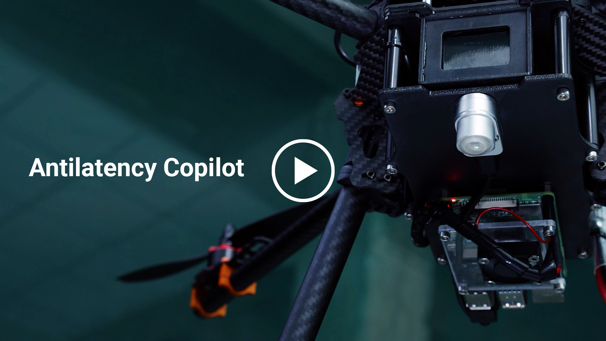
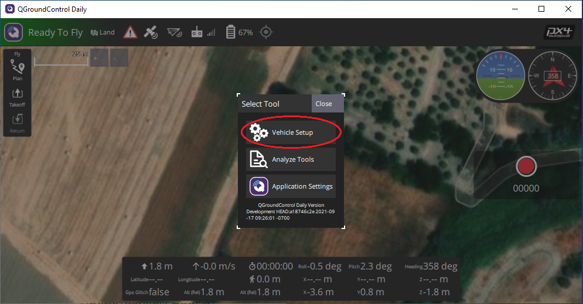
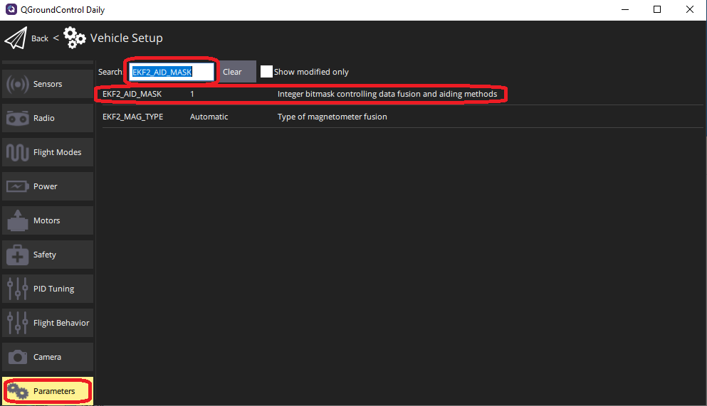
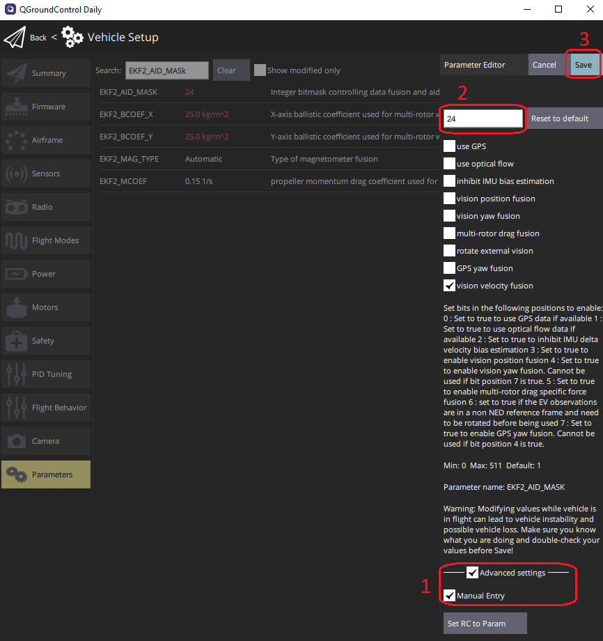
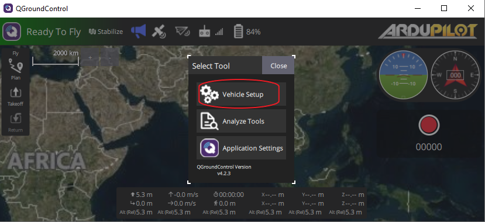
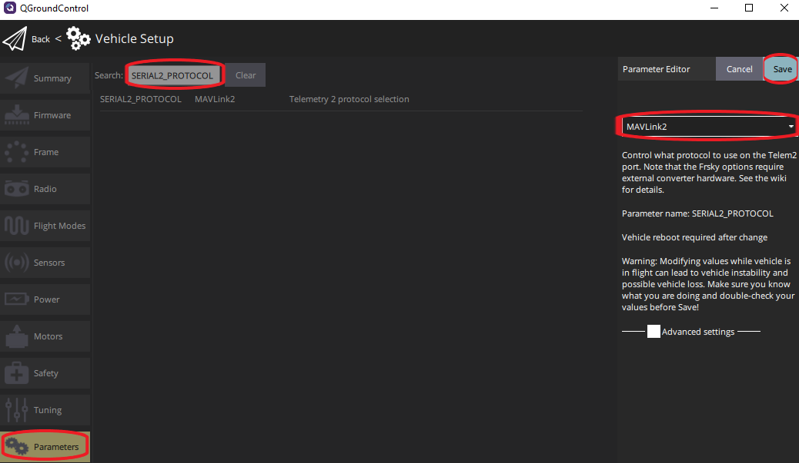

<h1 align="center">Antilatency Copilot - precise outdoor landing and indoor positioning for drones</h1>

<br>

<p align="center">
  <a href="https://copilot.antilatency.com/">
    
  </a>
  <br>
  <br>
  <i>Antilatency Copilot is a positional solution based on Antilatency tracking system and
    <br> Raspberry Pi that provides you with precise indoor navigation and outdoor landing for 
    <br> drones
  </i>
  <br>
</p>

<br>

<p align="center">
  <a href="https://copilot.antilatency.com/"><strong>copilot.antilatency.com</strong></a>
</p>

<br>

<p align="center">
  <a href="https://discord.gg/ZTqmfPsGEr"></a>
</p>

<br>

# Antilatency Copilot Demo C++

This project features Antilatency Copilot Demo, which provides functionality for autonomous drone landing at predefined coordinates and indoor navigation for drones using [Antilatency libraries] and [MAVSDK]. Copilot currently supports [PX4] autopilot and Ardupilot. Other ones are coming soon.

<p align="center">
  <a href="https://youtu.be/T4TEdzSLyi0" target="_blank">
    
  </a>
</p>
 
## Table of contents
* [Overview](#overview)
* [Getting started](#getting-started)
* [Installing an operating system on Raspberry Pi](#installing-an-operating-system-on-raspberry-pi)
    * [Configuring Raspberry Pi serial port](#configuring-raspberry-pi-serial-port)
* [Installing MAVSDK](#installing-mavsdk)
* [Placing an Alt on a drone and connecting to pixhawk type autopilot](#placing-an-alt-on-a-drone-and-connecting-to-pixhawk-type-autopilot)
* [Configuring PX4 to work with Copilot](#configuring-px4-to-work-with-copilot)
* [Configuring Ardupilot to work with Copilot](#configuring-ardupilot-to-work-with-copilot)
* [Compiling an AntilatencyCopilotDemo app](#compiling-an-antilatencycopilotdemo-app)
* [Running the AntilatencyCopilotDemo app](#running-the-antilatencycopilotdemo-app)
    * [Determining landing coordinates mode](#determining-landing-coordinates-mode)
    * [Landing mode](#landing-mode)


## Overview 

Structure: 
* ./AntilatencySdk/Api contains headers for Antilatency libraries;
* ./AntilatencySdk/Bin/ contains prebuilt libraries;
* ./Src contains project with example сode.

You`ll need
* A Raspberry Pi 3 or 4 single board computer.
* A microSD card with installed operating system (OS) and [MAVSDK].
* A pair of Antilatency devices: an [Alt] and a [Wired USB Socket].
* A computer with Windows 10 and installed [AntilatencyService], [QGroundControl].
* A properly assembled tracking area. An appropriate to [Environment] should be added to [AntilatencyService].
* A drone with PX4 or Ardupilot.

## Getting started

## Installing an operating system on Raspberry Pi:

Download and install [Raspberry Pi Imager] to a computer with an SD card reader. Put the SD card you'll use with your Raspberry Pi into the reader and run Raspberry Pi Imager.

1) CHOOSE OS: Raspberry Pi OS (32-bit) *(recommend)*
2) Press CTRL+SHIFT+X to preconfigure OS
* Set hostname: CopilotDemo *(for example)*
* Enable SSH *(use password authentication)*
* Set username 'pi' and password *(do not forget it)*
* Configure wireless LAN. The name of your WiFi hotspot and password of your WiFi hotspot.
3) CHOOSE STORAGE: choose your microSD card.
4) Click the WRITE button to write and verify the SD card.

Insert the microSD card with the OS image into Raspberry Pi, and turn it on. 

Open Command Prompt (cmd) on your PC and execute:

`ssh pi@<hostname>.local` *(example: `ssh pi@CopilotDemo.local`)*

or open the list of devices on your WiFi network and find the given ip-address for RPi

`ssh pi@<ip-address>` *(example: `ssh pi@192.168.1.64`)*

When asked to establish a connection, enter yes. Then enter the password you assigned earlier when writing the microSD card.

If all goes well you will see:

`pi@<hostname>:~$`

You are working in terminal on your Raspberry Pi!

Next, get the latest system updates.
Execute commands in terminal:

`sudo apt update`

`sudo apt full-upgrade`

### Configuring Raspberry Pi serial port

Execute commands in terminal:

`sudo raspi-config`

You should then see a blue screen with options in a grey box.

Use the up and down arrow keys to move the highlighted selection between the options available. Pressing the right arrow key will lead you out of the Options menu and take you to the "Select" and "Finish" buttons. Pressing left will take you back to the options. Alternatively, you can use the Tab key to switch between these.

Choose Interface Options

<p align="center">
</p>

and then Serial Port

<p align="center">
</p>

for the first request select "No"

<p align="center">
</p>

for the second request select "Yes"

<p align="center">
</p>

Agree to restarting the Raspberry Pi.

You will need to reconnect to your Raspberry PI to continue.

`ssh pi@<hostname>.local`

## Installing MAVSDK

Install the MAVSDK v1.4.0 using building MAVSDK library from source.

Install packages build-essential, cmake, git:

`sudo apt-get install build-essential cmake git`

Download the MAVSDK source using git:

`git clone -b v1.4.0 https://github.com/mavlink/MAVSDK.git`

Enter the folder with cloned files:

`cd MAVSDK/`

Make sure to get all the submodules as well:

`git submodule update --init --recursive`

Install python implementation of the MAVLink protocol by entering the following commands in sequence:

```
sudo apt-get install gcc python3-dev libxml2-dev libxslt-dev
sudo apt-get install python3-numpy python3-pytest
sudo apt-get install python3-pip  - optional
sudo python -m pip install --upgrade future lxml
sudo python -m pip install --upgrade pymavlink
```
Building and install MAVSDK. Configure first, then build:
```
sudo cmake -Bbuild/default -DCMAKE_BUILD_TYPE=Release -H.
sudo cmake --build build/default -j4
```

If you are getting linker errors about atomic functions
```
undefined reference to '__atomic_fetch_add_8'
```
try adding the line `target_link_libraries(mavsdk PUBLIC atomic)` to `src/mavsdk/CMakeLists.txt`

Install system-wide

`sudo cmake --build build/default --target install`

MAVSDK is installed!

Exit to the root directory 

`cd ..`

## Placing an Alt on a drone and connecting to pixhawk type autopilot 

Place a [Wired USB Socket] with an [Alt] on the surface of your drone so that an Alt has a lower hemisphere field view if the tracking area is on the floor, or an upper hemisphere field view if the tracking area is on the ceiling.

Place your RPi on the drone and connect it to the Wired USB Socket using a USB type-c cable.

Connect RPi to autopilot as shown:

<p align="center">
</p>

## Configuring PX4 to work with Copilot

PX4 autopilot settings are set in QGroundControl
<p align="center">
</p>

Go to the “Parameters” tab and find the parameter “EKF2_AID_MASK". Go to Parameter Editor by pressing LMB.
<p align="center">
</p>

Check "Advanced settings" and "Manual Entry" in the Parameter Editor. Then enter value 24 and Save parameter.

<p align="center">
</p>

Then, find the following parameters and set the values without using "Advanced settings".

|Parameter|Value|
|---|---|
|EKF2_EV_DELAY|20.0ms|
|EKF2_HGT_MODE|Vision|
|MAV_1_CONFIG|TELEM2|
|MAV_1_RATE|92160 B/s|

## Configuring Ardupilot to work with Copilot

Ardupilot settings are set in QGroundControl

<p align="center">
</p>

Go to the “Parameters” tab and set follow value for parameters:

<p align="center">
</p>

Parameter|Value|
|---|---|
|SERIAL2_PROTOCOL|MAVLink2|
|SERIAL2_BAUD|921600|
|AHRS_EKF_TYPE|Enable EKF3|
|EK2_ENABLE|Disabled|
|EK3_ENABLE|Enabled|
|EK3_SRC1_POSXY|6|
|EK3_SRC1_POSZ|6|
|EK3_SRC1_VELXY|6|
|EK3_SRC1_VELZ|6|
|EK3_SRC1_YAW|6|
|GPS_TYPE|None|
|VISO_TYPE|MAV|
|COMPASS_USE|Disabled|
|COMPASS_USE2|Disabled|
|COMPASS_USE3|Disabled|


## Compiling an AntilatencyCopilotDemo app

Clone the repository from [Github]

 `git clone --recurse-submodules https://github.com/antilatency/Antilatency.Copilot`

Create a directory for the executable file.
```
cd Antilatency.Copilot/
mkdir build
cd build/
```
Сompile and build the project from the terminal:
```
sudo cmake ../
sudo make
```
The /build directory now contains the executable AntilatencyCopilotDemo file  and libraries.

You may need to run AntilatencyCopilotDemo as root to work with USB devices (i.e. sudo ./AntilatencyCopilotDemo ...) or add rule for Antilatency USB devices:

```
echo 'SUBSYSTEM=="usb", ATTRS{idVendor}=="3237", MODE="0666", GROUP="pi"' | sudo tee /etc/udev/rules.d/66-antilatency.rules
```

##  Running the AntilatencyCopilotDemo app

The executable AntilatencyCopilotDemo file can be run in two modes:
The [Determining landing coordinates mode](#determining-landing-coordinates-mode) is used to determine the coordinates of the desired landing point.
The [Landing mode](#landing-mode) is landing at the specified coordinates using the standard Land command from your RC System.

### Determining landing coordinates mode
During launch, the executable file AntilatencyCopilotDemo expects two arguments: [Environment] data as the first argument and [Placement] data as the second argument. Both arguments can be derived from [AntilatencyService]. Copy the link to Environment and Placement using the Copy link menu item (in Windows Desktop version) or Share... (in version for Universal Windows Platform and Android).

For example, links to Environment and Placement may look like this:

Environment link:

 `http://www.antilatency.com/antilatencyservice/environment?data=AntilatencyAltEnvironmentHorizontalGrid~AgZ5ZWxsb3cEBLhTiT_cRqA-r45jvZqZmT4AAAAAAAAAAACamRk_AAQBAAAAAQEBAwADAQE&name=Floor_2400x2400`

Placement link: 

`http://www.antilatency.com/antilatencyservice/placement?data=AAAAAAAAAAAAj8J1PdoPyT8AAAAA2g9JwA&name=mydroneconfiguration1`

To get Environment and Placement data from the links, leave out fragments after data= and before &name=

Below are Environment and Placement data arguments for the AntilatencyCopilotDemo:

Environment data: 

`AntilatencyAltEnvironmentHorizontalGrid~AgZ5ZWxsb3cEBLhTiT_cRqA-r45jvZqZmT4AAAAAAAAAAACamRk_AAQBAAAAAQEBAwADAQE`

Placement data: 

`AAAAAAAAAAAAj8J1PdoPyT8AAAAA2g9JwA`
 
Run AntilatencyCopilotDemo.
 
`./AntilatencyCopilotDemo AntilatencyAltEnvironmentHorizontalGrid~AgZ5ZWxsb3cEBLhTiT_cRqA-r45jvZqZmT4AAAAAAAAAAACamRk_AAQBAAAAAQEBAwADAQE AAAAAAAAAAAAj8J1PdoPyT8AAAAA2g9JwA`
 
Immediately after the run, the program will create ADN, find a connected Alt and start tracking.

<p align="center">
</p>

After starting tracking, the program will request the state of an Alt and output its extrapolated state every 1 second (1FPS) into the terminal:
 
Position - the tridimensional worldspace position of the object. Position is measured in meters.

Yaw - yaw about the y-axis of the environment.
 
Stability stage - if it's Tracking6Dof, tracking data is good.
 
The Position coordinates correspond to the NED coordinates of the drone as follows:

x - east

z - north

y - negative down

<p align="center">
</p>

Place the drone on the spot where you want it to land via the Land command.

 Remember the position values to exactly three decimal places and the value of yaw to integer precision.

For example:
<p align="center">
</p>

X = 0.000, Z = 0.000, Y = 0.151, Yaw = 357. 

End the program with Ctrl+C.

### Landing mode

When starting the Landing mode, you must be sure that your drone is calibrated and all instructions from [here](#placing-an-alt-on-a-drone-and-connecting-to-pixhawk-type-autopilot) and [here](#configuring-px4-to-work-with-copilot) or [here](#configuring-ardupilot-to-work-with-copilot) have been followed.

Run the program, only this time add the following arguments to Environment (1-arg) and Placement(2-arg) data arguments:
|№arg|param|
|---|---|
|3| X|
|4| Z|
|5| Y|
|6| Yaw|
|7| Safe altitude|
|8| accuracy XZ
|9| accuracy Yaw

Safe altitude is a safe height at which the drone will travel to the landing point.

Accuracy XZ - accuracy of adherence to the set coordinates of the landing point (Copilot works in conjunction with the autopilot, and positioning accuracy depends, among other things, on how well your drone is calibrated. During the first tests, it is recommended to land on a flat surface with an accuracy of at least 0.05 in order to evaluate the algorithm as a whole).

Accuracy YAW - accuracy of compliance with the specified angle Yaw (it is also recommended to set the accuracy to at least 5 during the first tests)

The first step to landing on a target is - move to a safe altitude, second step - move along the safe altitude to a target point, and third step - land.

<p align="center">
</p>

After run app you will see the data you set:

<p align="center">
</p>

Also, you can see the correspondence of tracking coordinates and NED - coordinates in QGroundControl:

<p align="center">
</p>

You can now fly your drone. 

When you decide to land at the given coordinates, give the command **once** from your RC or from QGroundControl. If at this moment the drone is in the tracking area Copilot will take over control, switching flight mode to offboard mode and landing at the specified coordinates!

[Alt]: <https://developers.antilatency.com/Hardware/Alt_en.html>

[Antilatency libraries]: <https://developers.antilatency.com/Software/Libraries_en.html>

[AntilatencyService]: <https://developers.antilatency.com/Software/AntilatencyService_en.html>

[building MAVSDK library from source]: <https://mavsdk.mavlink.io/main/en/cpp/guide/build.html>

[Environment]: <https://developers.antilatency.com/Terms/Environment_en.html>

[Github]: <https://github.com/antilatency/Antilatency.Copilot>

[Placement]: <https://developers.antilatency.com/Terms/Placement_en.html>

[MAVSDK]: <https://mavsdk.mavlink.io/main/en/index.html>

[PX4]: <https://px4.io>

[QGroundControl]: <http://qgroundcontrol.com/>

[QGroundControl "Land"]: <https://docs.qgroundcontrol.com/master/en/FlyView/FlyView.html#land>

[assigned]: <https://docs.qgroundcontrol.com/master/en/SetupView/FlightModes.html>

[Raspberry Pi Imager]: <https://www.raspberrypi.com/software/>

[Wired USB Socket]: <https://developers.antilatency.com/Hardware/WiredUSBSocket_en.html>
