# Antilatency Copilot Demo C++

CoPilot is an Antilatency project. We use our accurate optical-inertial tracking system with Raspberry Pi to provide you with precise indoor navigation and outdoor landing for drones in different use cases.

This project features Antilatency Copilot Demo, which provides functionality for autonomous landing of drones equipped with a [PX4] autopilot at predefined coordinates using Antilatency libraries and [MAVSDK].

[<p align="center">
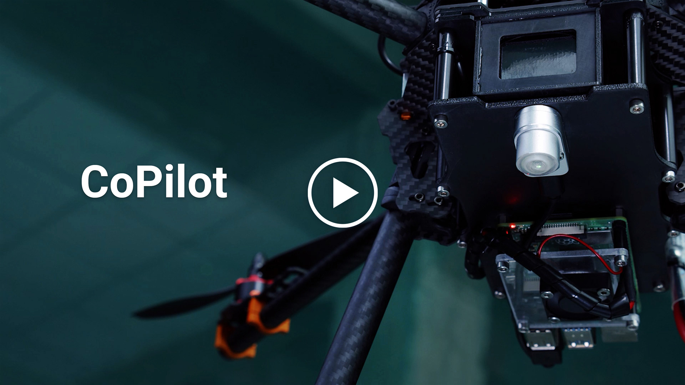</p>](https://youtu.be/T4TEdzSLyi0)

## Table of Contens
* [Overview](#overview)
* [Getting started](#getting-started)
* [How to install operating system on Raspberry Pi](#how-to-install-operating-system-on-raspberry-pi)
    * [Configure Raspberry Pi serial port](#configure-raspberry-pi-serial-port)
* [How to install MAVSDK](#how-to-install-mavsdk)
* [How to place an Alt on a drone and connect to PX4](#how-to-place-an-alt-on-a-drone-and-connect-to-px4)
* [How to compile an AntilatencyCopilotDemo app](#how-to-compile-an-antilatencycopilotdemo-app)
* [How to run app AntilatencyCopilotDemo](#how-to-run-app-antilatencycopilotdemo)
    * [First mode](#first-mode)
    * [Second mode](#second-mode)


## Overview 

Structure: 
* ./AntilatencySdk/Api contains headers for Antilatency libraries;
* ./AntilatencySdk/Bin/ contains prebuilt libraries;
* ./Src contains project with code of example.

You need
* A Raspberry Pi 3 or 4 single board computer.
* A microSD card with installed operating system (OS) and MAVSDK.
* A pair of Antilatency devices: an [Alt] and a [Wired USB Socket].
* A computer with Windows 10 and installed [AntilatencyService].
* An properly assembled tracking area. Appropriate to her [Environment] should be added to [AntilatencyService].
* A drone with PX4 autopilot.

## Getting started

## How to install operating system on Raspberry Pi:

Download and install [Raspberry Pi Imager] to a computer with an SD card reader. Put the SD card you'll use with your Raspberry Pi into the reader and run Raspberry Pi Imager.

1) CHOOSE OS: Raspberry Pi OS (32-bit) *(recommend)*
2) Press CTRL+SHIFT+X to preconfigure OS
* Set hostname: CopilotDemo *(for example)*
* Enable SSH *(use password authentication)*
* Set username 'pi' and password *(do not forget it)*
* Configure wireless LAN. The name of your WiFi hotspot and password of your WiFi hotspot.
3) CHOOSE STORAGE: choose your microSD card.
4) Push the WRITE button to write and verify the SD card.

Insert the microSD card with the OS image into Raspberry Pi, and turn it on. 

Open Command Prompt (cmd) on your PC and execute:

`ssh pi@<hostname>.local` *(example: `ssh pi@CopilotDemo.local`)*

or open the list of devices on your WiFi network and find the given ip-address for RPi

`ssh pi@<ip-address>` *(example: `ssh pi@192.168.1.64`)*

When asked to establish a connection, enter yes. Then enter the password you assigned earlier when writing the microSD card.

If all goes well you will see:

`pi@<hostname>:~$`

You are working in terminal on your Raspberry Pi!
Next, get the latest system updates.
Execute commands in terminal:

`sudo apt update`

`sudo apt full-upgrade`

### Configure Raspberry Pi serial port

Execute commands in terminal:

`sudo raspi-config`

You should then see a blue screen with options in a grey box.

Use the up and down arrow keys to move the highlighted selection between the options available. Pressing the right arrow key will jump out of the Options menu and take you to the "Select" and "Finish" buttons. Pressing left will take you back to the options. Alternatively, you can use the Tab key to switch between these.

Choose Interface Options

<p align="center">
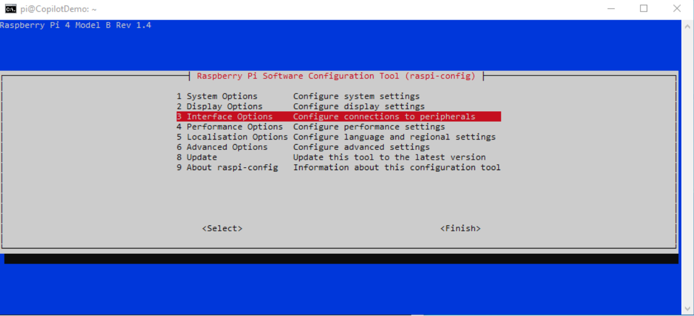</p>

and then Serial Port

<p align="center">
</p>

for the first request select "No"

<p align="center">
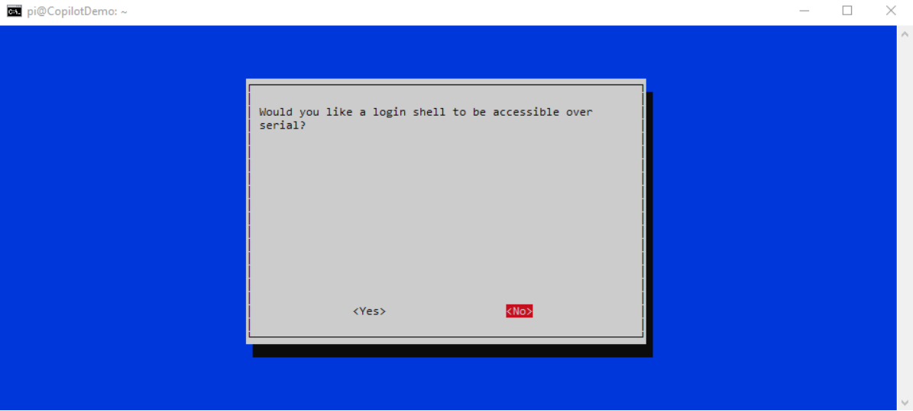</p>

for the second request select "Yes"

<p align="center">
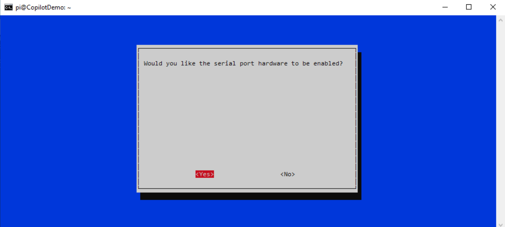</p>

Agree to restarting the Raspberry Pi.

You will need to reconnect to your Raspberry PI to continue.

`ssh pi@<hostname>.local`

## How to install MAVSDK

It is recommended to install the MAVSDK using the [building MAVSDK library from source], as other methods contain bugs and may not be completed correctly.

Install packages build-essential, cmake, git:

`sudo apt-get install build-essential cmake git`

Download the MAVSDK source using git:

`git clone https://github.com/mavlink/MAVSDK.git`

Enter the folder with cloned files:

`cd MAVSDK/`

Make sure to get all the submodules as well:

`git submodule update --init --recursive`

Install python implementation of the MAVLink protocol by entering the following commands in sequence:

```
sudo apt-get install gcc python3-dev libxml2-dev libxslt-dev
sudo apt-get install python3-numpy python3-pytest
sudo python -m pip install --upgrade future lxml
sudo python -m pip install --upgrade pymavlink
```
Building and install MAVSDK. Configure first, then build:
```
sudo cmake -Bbuild/default -DCMAKE_BUILD_TYPE=Release -H.
sudo cmake --build build/default -j8
```

Install system-wide

`sudo cmake --build build/default --target install`

MAVSDK is installed!
Exit to the root directory `cd ..`

## How to place an Alt on a drone and connect to PX4 

Place a [Wired USB Socket] with an [Alt] on the surface of your drone so that an Alt has a lower hemisphere field view if the tracking area is on the floor, or an upper hemisphere field view if the tracking area is on the ceiling.

Place your RPi on the drone and connect it to the Wired USB Socket using a USB type-c cable.

Connect RPi to PX4 as shown:

<p align="center">
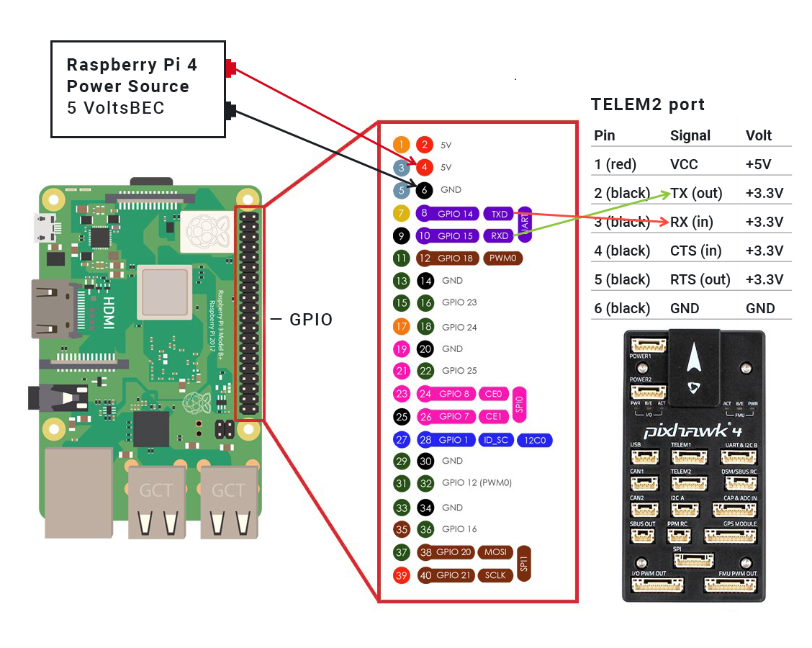</p>

PX4 autopilot settings are set in QGroundControl
Vehicle Setup -> Parameters

|Parametr|Value|
|---|---|
|EKF2_AID_MASK|24|
|EKF2_EV_DELAY|14.0ms|
|EKF2_HGT_MODE|Vision|
|MAV_1_CONFIG|TELEM2|
|MAV_1_RATE|921600 B/s|

## How to compile an AntilatencyCopilotDemo app

Make a project directory in the file system. Select it.

```
cd <full path to project directory> 
mkdir <project directory> 
cd <project directory>
```
For example,
```
cd /home/pi
mkdir AntilatencyCopilotDemo
cd AntilatencyCopilotDemo
```
Clone the repository from [Github]

 `git clone --recurse-submodules https://github.com/antilatency/Antilatency.Copilot`

Create a directory for the executable file.
```
cd ./AntilatencyCopilotDemo/Antilatency.Copilot
mkdir build
cd ./build
```
Сompile and build the project from the terminal:
```
sudo cmake ../
sudo make
```
The ./build directory now contains the executable file AntilatencyCopilotDemo and libraries.

## How to run app AntilatencyCopilotDemo

The executable file AntilatencyCopilotDemo can be run in two modes:
The [first mode](#first-mode) is used to determine the coordinates of the desired landing point.
The [second mode](#second-mode) is landing at the specified coordinates using the standard Land command from your RC System.

### First mode
During launch, the executable file AntilatencyCopilotDemo expects two arguments: [Environment] data as the first argument and [Placement] data as the second argument. Both arguments can be derived from [AntilatencyService]. Using the Copy link menu item (in Windows Desktop version) or Share... (in version for Universal Windows Platform and Android), copy the link to Environment and Placement.

For example, links to Environment and Placement may look like this:

Environment link:

 `http://www.antilatency.com/antilatencyservice/environment?data=AntilatencyAltEnvironmentHorizontalGrid~AgZ5ZWxsb3cEBLhTiT_cRqA-r45jvZqZmT4AAAAAAAAAAACamRk_AAQBAAAAAQEBAwADAQE&name=Floor_2400x2400`

Placement link: 

`http://www.antilatency.com/antilatencyservice/placement?data=AAAAAAAAAAAAj8J1PdoPyT8AAAAA2g9JwA&name=Identity`

To get Environment and Placement data from the links, leave fragments after data= and before &name=.

Below are Environment and Placement data arguments for the AntilatencyCopilotDemo:

Environment data: 

`AntilatencyAltEnvironmentHorizontalGrid~AgZ5ZWxsb3cEBLhTiT_cRqA-r45jvZqZmT4AAAAAAAAAAACamRk_AAQBAAAAAQEBAwADAQE`

Placement data: 

`AAAAAAAAAAAAj8J1PdoPyT8AAAAA2g9JwA`
 
Run AntilatencyCopilotDemo as a root user to work with USB devices.
 
`sudo ./AntilatencyCopilotDemo AntilatencyAltEnvironmentHorizontalGrid~AgZ5ZWxsb3cEBLhTiT_cRqA-r45jvZqZmT4AAAAAAAAAAACamRk_AAQBAAAAAQEBAwADAQE AAAAAAAAAAAAj8J1PdoPyT8AAAAA2g9JwA`
 
Immediately after the run, the program will create ADN, find a connected Alt and start tracking.

<p align="center">
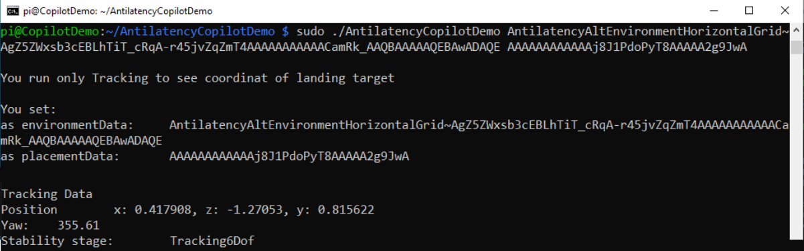</p>

After starting the tracking, the program will request the state of an Alt and output its state every 1 second (1FPS) in the terminal:
 
Position - the tridimensional worldspace pose of the object. Position is in meters.
Yaw - yaw about the z-axis of environment.
 
Stability stage - if it is Tracking6Dof, tracking data is good.
 
The Position coordinates correspond to the NED coordinates of the drone as follows:

x - east

z - north

y - negativ down

<p align="center">
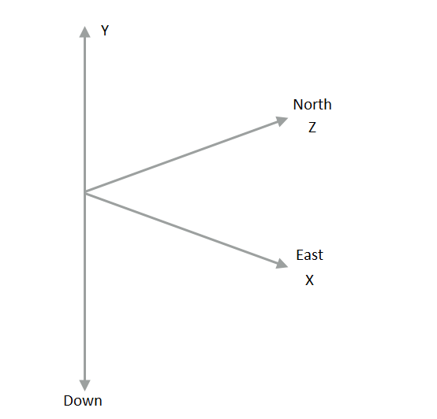</p>

Place the drone to the spot where you want it to land on the Land command.
For example, in the environment center:

<p align="center">
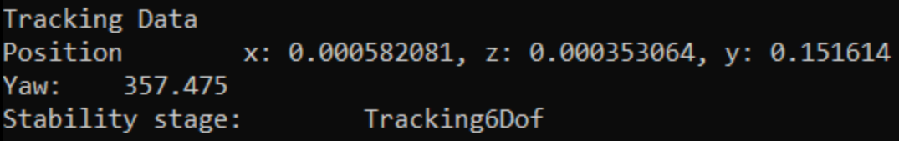</p>

Remember the values ​​of position to exactly three decimal places and the value of yaw to integer precision.
 
End the program with Ctrl+C.

### Second mode

When starting the second mode, you must be sure that your drone is calibrated and all instructions from [How to..](#how-to-place-an-alt-on-a-drone-and-connect-to-px4) have been followed.

Run the program, only this time add the following arguments to Environment (1-arg) and Placement(2-arg) data arguments:
|№arg|param|
|---|---|
|3| X|
|4| Z|
|5| Y|
|6| Yaw|
|7| Safe altituda|
|8| accuracy XZ
|9| accuracy Yaw

Safe altituda is the safe height at which the drone will travel to the landing point.

Accuracy XZ - accuracy of adherence to the set coordinates of the landing point (Copilot works in conjunction with the autopilot, and positioning accuracy depends, among other things, on how much your drone is calibrated. During the first tests, it is recommended to land on a flat surface with an accuracy of at least 0.03 in order to evaluate the algorithm as a whole).

Accuracy YAW - accuracy of compliance with the specified angle Yaw (it is also recommended to set the accuracy to at least 3 during the first tests)

The first step to landing on a target is - move to a safe altitude, second step - move along the safe altitude to a target point, and third step - land.

<p align="center">
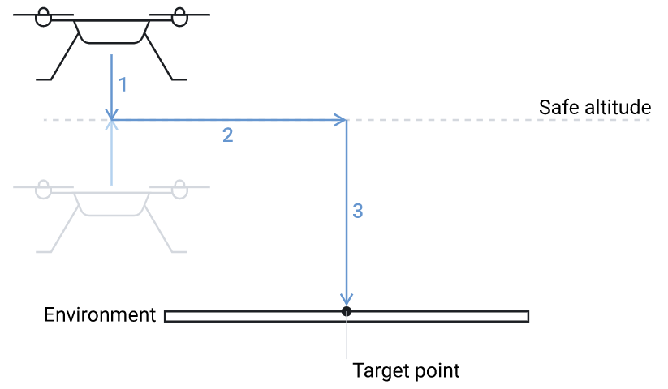</p>

After run app you will see the data you set:

<p align="center">
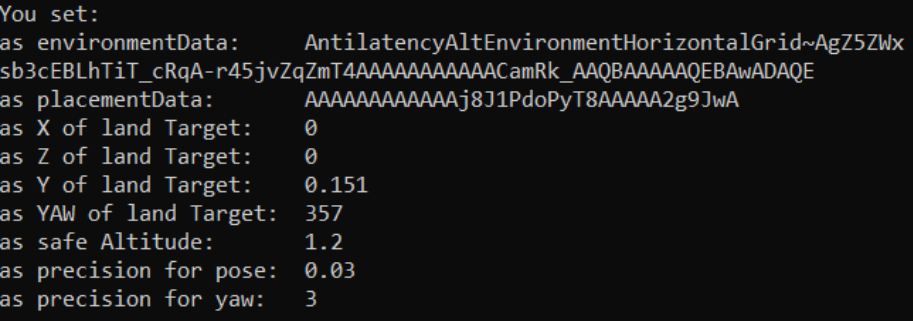</p>

If you notice an error, you can abort the program with Ctrl+C at any time and enter the correct parameters.

Next comes the connection to the autopilot and Alt:

<p align="center">
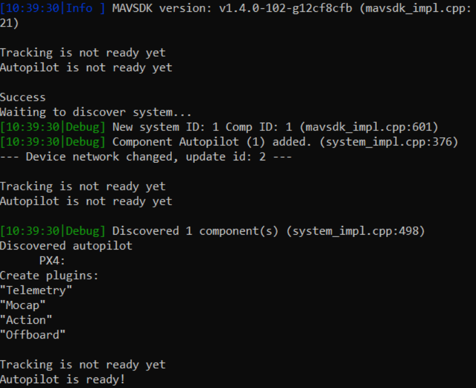</p>

When everything is ready, you will receive the corresponding message:

<p align="center">
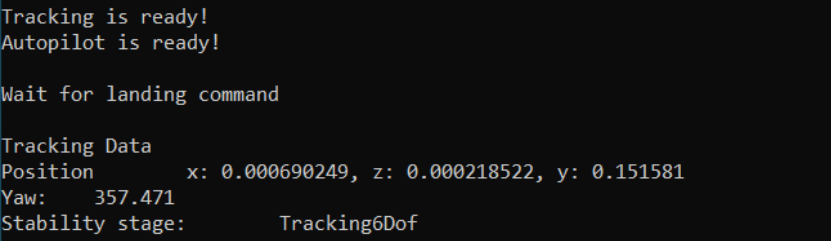</p>

Further, the current coordinates will appear in the console once every 5 seconds.
 
Also, you can see the correspondence of tracking coordinates and NED - coordinates in QGroundControl:

<p align="center">
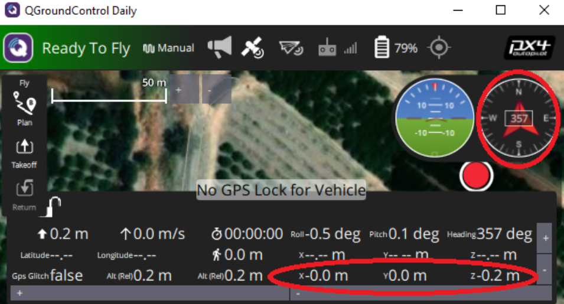</p>

You can now fly your drone 

When you decide to land at the given coordinates, give the command **once** from your RC or from QGroundControl. If at this moment the drone is in the tracking area Copilot will land at the specified coordinates!

[Alt]: <https://developers.antilatency.com/Hardware/Alt_en.html>

[Antilatency libraries]: <https://developers.antilatency.com/Software/Libraries_en.html>

[AntilatencyService]: <https://developers.antilatency.com/Software/AntilatencyService_en.html>

[building MAVSDK library from source]: <https://mavsdk.mavlink.io/main/en/cpp/guide/build.html>

[Environment]: <https://developers.antilatency.com/Terms/Environment_en.html>

[Placement]: <https://developers.antilatency.com/Terms/Placement_en.html>

[Github]: <https://github.com/antilatency/Antilatency.Copilot>

[MAVSDK]: <https://mavsdk.mavlink.io/main/en/index.html>

[PX4]: <https://px4.io>

[Raspberry Pi Imager]: <https://www.raspberrypi.com/software/>

[Wired USB Socket]: <https://developers.antilatency.com/Hardware/WiredUSBSocket_en.html>